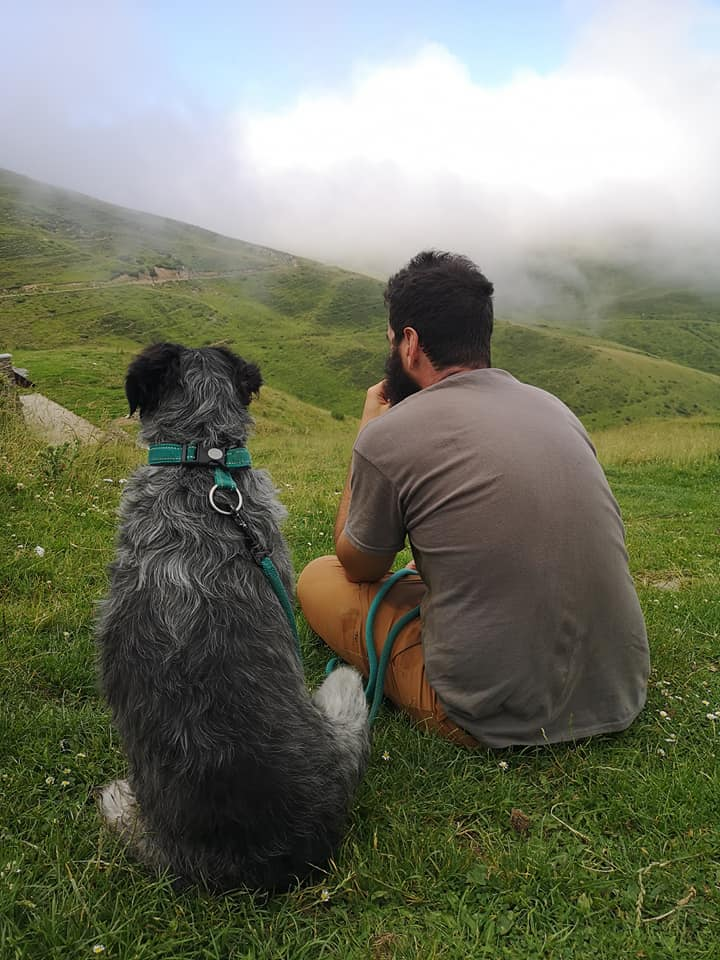
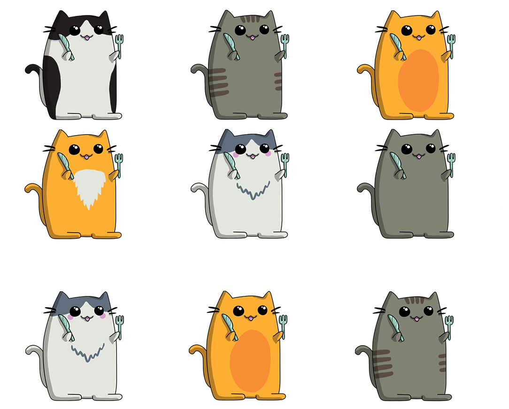
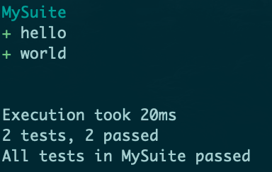
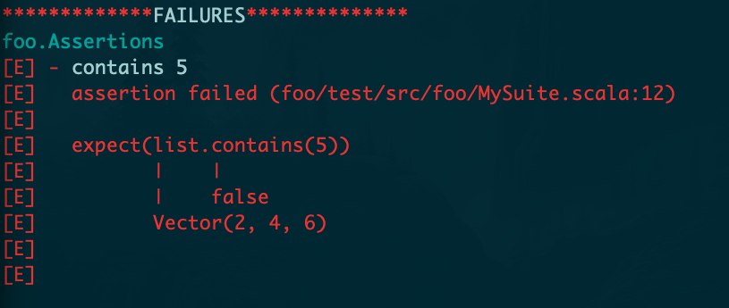
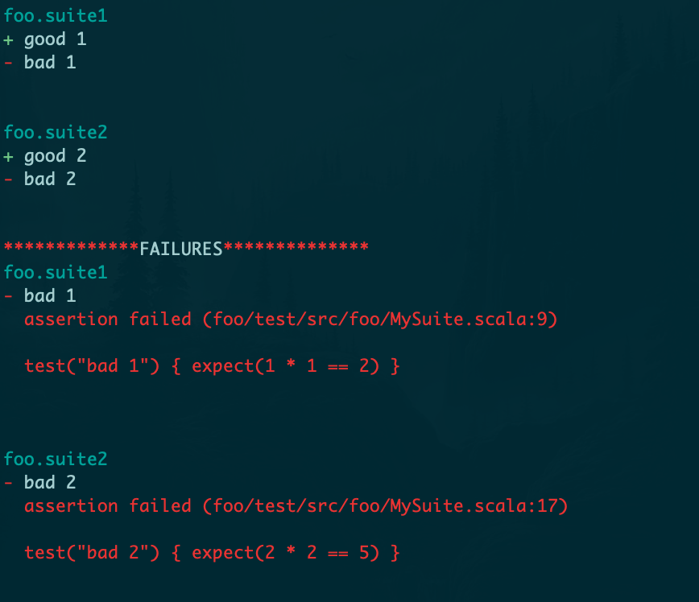
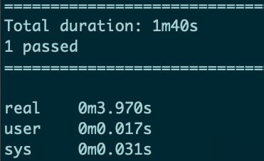
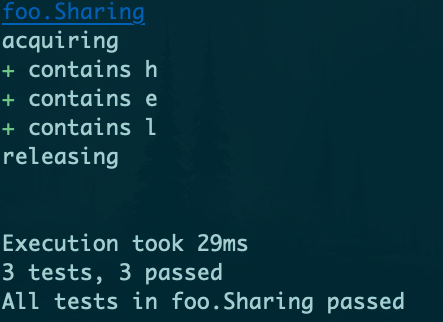

**Who am I ?**

* Olivier Mélois
* Scala since late 2013
* Works for Disney
* has 5 animals
* 95% vegetarian

---


**Where am I ?**


---

## An intro to cats-effect


## and weaver-test

---

**Agenda**

* Scala
* why pure FP matters ?
* cats-effect
* weaver-test

---

**Scala**


---

strongly typed, compiles to JVM

```scala mdoc:fail
case class Dog(name : String)
case class Cat(name : String)

def meow(cat : Cat) = println(s"$cat says meow")

meow(Dog("Barkinton the Third"))

```

---

Scala is imperative friendly ...

```scala mdoc
var i = 1
while(i < 10) {
  if (i % 2 == 1){
    println(i + 2)
  }
  i += 1
}
```

---

... but also functional friendly

```scala mdoc 
def isOdd(x : Int) = x % 2 == 1

(1 to 10).map(_ + 2).filter(isOdd).foreach(println)
```

---

Scala is (very) unopinionated ...

---

... but pure FP is getting traction

---

**Why pure FP matters ?**

---

**Playing music from code**

---


---

```scala mdoc:silent
import javax.sound.midi._
import javax.sound.midi.ShortMessage._

val info =  MidiSystem
              .getMidiDeviceInfo()
              .filter(_.getName == "Gervill").headOption
val device = info.map(MidiSystem.getMidiDevice).get
val rcvr = device.getReceiver()
```

---


```scala mdoc:silent
def note(key: Int, gateTime: Long) : Unit = {
  val msg = new ShortMessage

  msg.setMessage(NOTE_ON, 0, key, 93)
  rcvr.send(msg, -1) // side effect

  Thread.sleep(gateTime) // blocked thread

  msg.setMessage(NOTE_OFF, 0, key, 0)
  rcvr.send(msg, -1) // side effect
}
```

---

**Here's a piano ...**

```scala mdoc
val bpm = 66
val sq = 60L * 1000 / bpm / 4 //semiquaver (aka 16th)

object piano {
  def C(n: Int = 1) = note(60, sq * n)
  def D(n: Int = 1) = note(62, sq * n)
  def E(n: Int = 1) = note(64, sq * n)
  def F(n: Int = 1) = note(65, sq * n)
  def G(n: Int = 1) = note(67, sq * n)
  def A(n: Int = 1) = note(69, sq * n)
  def B(n: Int = 1) = note(71, sq * n)
  def c(n: Int = 1) = note(72, sq * n)
}
```

---

**... and here's a song**


```scala mdoc:compile-only
import piano._
C()
D()
E()
F()
G()
A()
B()
c(2)
```

---


<div id = "demo1"></div>


---

**... a song as a list of notes ?**

```scala
val song = List(C(), D(), E())
// song: List[Unit] = List((), (), ())


song ++ song
song.reverse
```
hmmm

---

**... two notes at the same time ?**

```scala
???
```
errr

---

Imperatively triggering side-effects

hinders expressiveness

---

**Side-effects ?**

* stdout/stdin
* RNG
* file-system interactions
* network calls
* playing sound

---

**... they break referential transparency**

```scala mdoc
import java.util.UUID

val uuidVal  = UUID.randomUUID()

uuidVal == uuidVal

UUID.randomUUID() == UUID.randomUUID()
```

---

Referential transparency enables compositionality

---

describing

vs

executing

---

declarative

vs

imperative

---

pure FP

vs

the world

---

1877: the phonograph


Listening to music is now decoupled from making it

---


---

Referentially transparent side-effects (in Scala)


zio / monix / cats-effect

---

**cats-effect**




---

**The IO type**

```scala mdoc:invisible
import cats.effect._
import scala.concurrent.ExecutionContext.global
import scala.concurrent.duration._
implicit val timer: Timer[IO] = IO.timer(global)
implicit val cs: ContextShift[IO] = IO.contextShift(global)
```


```scala mdoc:to-string
import cats.effect.IO

def printStr(o: Any) : IO[Unit] = IO(println(o.toString))

// IO records the side effect ...
val sideEffect = printStr("hello")

// ... for a later use
sideEffect.unsafeRunSync()
```

---

Composing side effects sequentially

```scala mdoc:to-string
import cats.implicits._

val twice = sideEffect *> sideEffect

twice.unsafeRunSync()
```

---

Composing side effects in parallel
```scala mdoc:silent
val hello = printStr("hello")
val world = printStr("world")
```


```scala mdoc
{
  val delayedWorld = world.delayBy(100.millis)
  val parallel = (delayedWorld, hello).parTupled
  parallel.void.unsafeRunSync()
}
```

---

Composing collections of side effects

```scala mdoc:to-string
val fiveTimes = (1 to 5).toList.traverse(printStr)

fiveTimes.void.unsafeRunSync()
```

---

Generic functions

```scala mdoc
implicit class ioExtensions[A](io : IO[A]) {
  val repeat : IO[Nothing] = io >> repeat
}
```

---

Forking/cancelling side effects

```scala mdoc:to-string

val helloWorlds = for {
  fork   <- world.delayBy(100.millis).repeat.start
  _      <- hello
  _      <- fork.cancel.delayBy(500.millis)
  _      <- printStr("!!")
} yield ()


helloWorlds.void.unsafeRunSync()
```

---


Back to our music sheet

---

Making notes referentially transparent

```scala mdoc
def pureNote(key: Int, gateTime: Long): IO[Unit] = {
  val press = IO {
    val msg = new ShortMessage
    msg.setMessage(NOTE_ON, 0, key, 93)
    rcvr.send(msg, -1)
  }
  val wait = IO.sleep(gateTime.millis)
  val release = IO {
    val msg = new ShortMessage
    msg.setMessage(NOTE_ON, 0, key, 0)
    rcvr.send(msg, -1)
  }
  press *> wait *> release
}
```

---

Our pure piano ...

```scala mdoc
object piano2 {
  def C(n: Int = 1) = pureNote(60, sq * n)
  def D(n: Int = 1) = pureNote(62, sq * n)
  def E(n: Int = 1) = pureNote(64, sq * n)
  def F(n: Int = 1) = pureNote(65, sq * n)
  def G(n: Int = 1) = pureNote(67, sq * n)
  def A(n: Int = 1) = pureNote(69, sq * n)
  def B(n: Int = 1) = pureNote(71, sq * n)
  def c(n: Int = 1) = pureNote(72, sq * n)
}
```

---

... and our song :

```scala mdoc:silent
import piano2._

val notes : List[IO[Unit]] =
  List(C(), D(), E(), F(), G(), A(), B(), c(2))

val sequencedNotes : IO[List[Unit]] = notes.sequence
val scale : IO[Unit] = sequencedNotes.void
```

---

Other songs:

```scala mdoc:silent
val reversed = notes.reverse.sequence.void

val repeated = scale.repeat

val revRepeated = reversed.delayBy((2 * sq).millis)

// Running 4 and 5 in parallel
val song = (repeated, revRepeated).parTupled.void
```

---

<div id = "demo2"></div>


---

**Cats-effect: resource management**

---

Not shown in the previous slides :

```scala mdoc:compile-only
device.open()
try {

  // music goes here

} finally {
  device.close()
}
```

---

Problems :

* try/finally tricky with concurrency
* opening/closing a device are side effects

---

Solution:

```scala mdoc
import cats.effect.Resource
```

---

Step 1: suspend all the side effects

```scala mdoc
// what happens before "try"
def acquire(i : Int) : IO[Int] =
  printStr(s"acquiring $i").map(_ => i)

// what happens inside "finally"
def release(i : Int) : IO[Unit] =
  printStr(s"releasing $i")
```

---

Step 2: combine acquisition and release

```scala mdoc
def res(i : Int) : Resource[IO, Int] =
  Resource.make(acquire(i))(release)
```

---

Step 2 (bis): compose resources

```scala mdoc:silent
val myResource : Resource[IO, List[Int]] = for {
  x1 <- res(1)
  x2 <- res(2)
  x3 <- res(x1 + x2)
} yield List(x1, x2, x3)
```

---

Step 3: use the resource

```scala mdoc:silent
// what we want inside "try"
def printAll(list: List[Int]) : IO[Unit] =
  list.map(_.toString).traverse(printStr).void

val program : IO[Unit] = myResource.use(printAll)
```

---

Step5: run the program

```scala mdoc
program.unsafeRunSync()
```

---

Back to our music ...

---

Step 1: suspend all the side effects

```scala mdoc:silent
val acquireDevice : IO[MidiDevice] = IO {
  MidiSystem.getMidiDeviceInfo()
            .filter(_.getName == "Gervill")
            .headOption
            .get
}.flatMap { info => IO(MidiSystem.getMidiDevice(info))
}.flatTap { device => IO(device.open)}

def releaseDevice(d: MidiDevice) : IO[Unit] = IO(d.close())
```

---

Step 2: combine acquisition and release

```scala mdoc:silent
import javax.sound.midi.Receiver

val makePiano: Resource[IO, PurePiano] =
  Resource
    .make(acquireDevice)(releaseDevice)
    .map(d => new PurePiano(d.getReceiver()))

class PurePiano(rcvr: Receiver) {
  // ... note definitions
}
```

---

Step 3: use the resource

```scala
makePiano.use(piano => playSong(piano))
```

---
**Cats-effect: concurrency primitives**

* atomic reference
* semaphores
* promises
* etc ...

---

**Weaver-test**


https://disneystreaming.github.io/weaver-test/

---

**Motivations**

* speed
* debuggability
* maintainability

---

Conciseness

```scala 
import weaver._

object MySuite extends SimpleIOSuite {

  test("hello") {
    expect("hello".length() == 5)
  }

  test("world") {
    IO(expect("world".length() == 5))
  }

}

```

---




---


Clear reporting

```scala
test("contains 5") {
  val list = (1 to 3).map(_ * 2)
  expect(list.contains(5))
}
```

---



---

Aggregated failure reports

```scala
object suite1 extends SimpleIOSuite {
  test("good 1") { expect(1 + 1 == 2) }
  test("bad 1") { expect(1 * 1 == 2) }
}

object suite2 extends SimpleIOSuite {
  test("good 2") { expect(2 + 2 == 4) }
  test("bad 2") { expect(2 * 2 == 5) }
}
```

---




---

Composable assertions

```scala
val i = 5
expect(i < 0) || expect(i > 2) && expect(i < 6)
```

---

Parallelism by default

```scala
for (i <- 1 to 100) test(s"hello $i") {
  IO(expect("hello".length() == 5)).delayBy(1.second)
}
```

---



---

Principled resource management

```scala
override type Res = String
override def sharedResource: Resource[IO, String] =
  Resource
    .make(printStr("acquiring"))(_ => printStr("releasing"))
    .map(_ => "hello")

val chars =  List('h', 'e', 'l')

for (c <- chars) test(s"contains $c") { shared =>
  expect(shared.contains(c))
}
```

---



---

Conclusion

---

github links :

* [typelevel/cats-effect](https://github.com/typelevel/cats-effect)
* [disneystreaming/weaver-test](disneystreaming/weaver-test)

Thanks for listening :)

---

We are hiring

* Senior Scala Engineer - Manchester
* Senior Scala Engineer - London
* Scala Engineer        - London


Jenna Eddie - jenna.eddie@disneystreaming.com

Sam Facer   - sam.facer@disneystreaming.com

---

Questions ?


